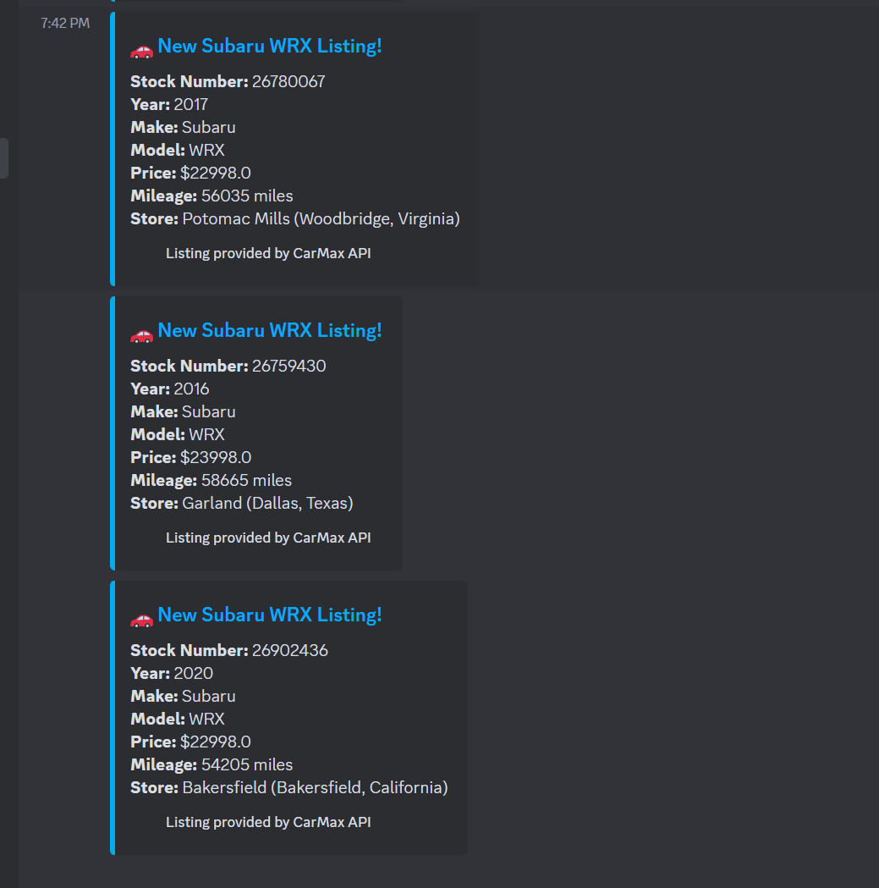

# CarScraper
This is a specialized version of a Car monitor that I tweaked for Subaru. A python scrapter that monitors car listings on carmax and sends results to a discord webhook.
I built this entire in Python, using the Requests library and the CarmMax API. 

## Features
- Scrapes new Subaru WRX listings from CarMax.
- Sends notifications to a Discord webhook.
- Prevents duplicate alerts using a tracking system.
- Configurable search parameters (price, year, mileage, etc.).
- Parameters can be adjusted for any vehicle listed on CarMax

## Installation

1. Clone the repository:
   ```bash
   git clone https://github.com/amasoo280/WRX-Monitor.git
   ```
2. Navigate to the project directory:
   ```bash
   cd WRX-Monitor
   ```
3. Install the required dependencies:
   ```bash
   pip install -r requirements.txt
   ```
4. Configure environment variables (see below).

## Configuration

Create a `.env` file in the root directory and add the following environment variables:

```plaintext
DISCORD_WEBHOOK_URL=your_discord_webhook_url
CARMAX_URI=your_carmax_uri
ZIPCODE=your_zipcode
VISITOR_ID=your_carmax_visitor_id
VEHICLE=Subaru WRX

Create a discord Webhook.
Head to any discord server which you have webhook access in and follow these steps:
- Settings
- Integrations
- Webhook
- New webhook
- Paste webhook in to the .env DISCORD_WEBHOOK_URL

